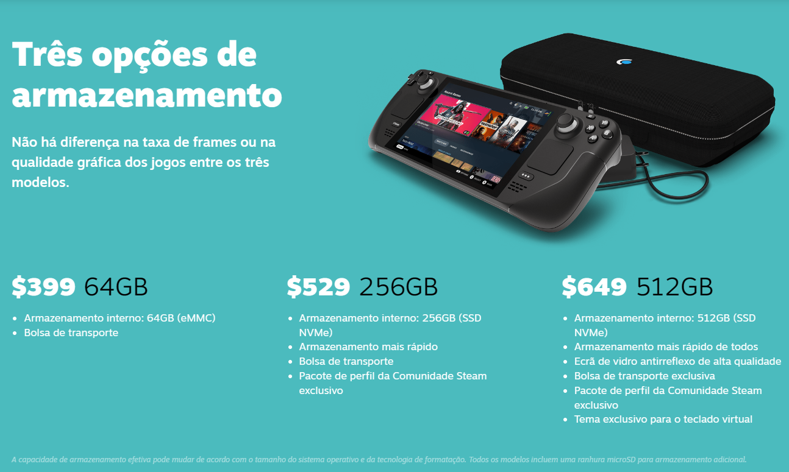
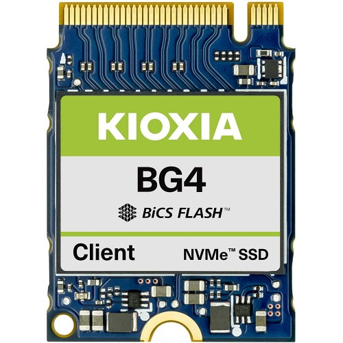
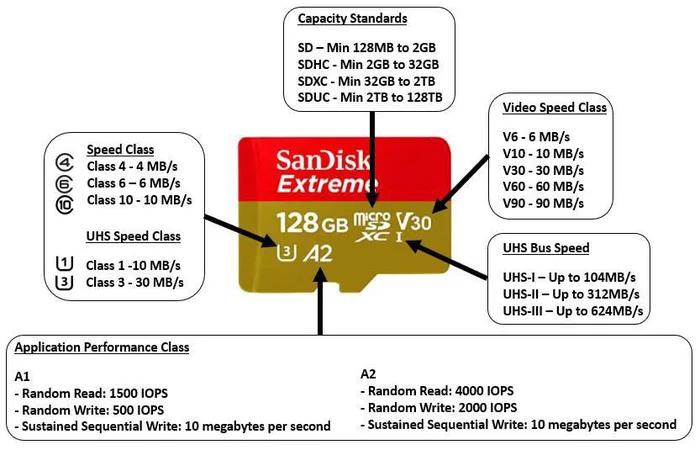

# steamdeck-br
[steamdeck.valdecir.me](http://steamdeck.valdecir.me)

Conteúdo sobre Steam Deck em Português compilado e traduzido por [Valdecir Carvalho](https://iamval.me).

> Recentemente (20/01/2023) comprei um Steam Deck e depois disso comecei a procurar conteúdo sobre o console da Valve em Português e não encontrei muita coisa, por isso, resolvi criar essa pagina para compilar links e recursos sobre o Steam Deck em PT-BR e em Inglês ao qual pretendo ir traduzindo para o Português.

**ATENÇÃO: TODOS OS LINKS AQUI IRÃO ABRIR AUTOMATICAMENTE NA MESMA ABA, PARA MANTER ESSA PÁGINA ABERTA, CLIQUE NO LINK COM A TECLA CRTL APERTADA**

----
- [steamdeck-br](#steamdeck-br)
- [O Steam Deck](#o-steam-deck)
  - [O que é o Steam Deck?](#o-que-é-o-steam-deck)
  - [Informações Oficiais](#informações-oficiais)
  - [Especificações técnicas](#especificações-técnicas)
    - [Componentes](#componentes)
- [Modelos Disponíveis](#modelos-disponíveis)
  - [Steam Deck no Brasil](#steam-deck-no-brasil)
  - [Qual comprar?](#qual-comprar)
  - [Acessórios "Obrigatórios"](#acessórios-obrigatórios)
  - [Links Oficiais](#links-oficiais)
    - [Português Brasil](#português-brasil)
    - [Inglês](#inglês)
  - [Redes Sociais](#redes-sociais)
    - [Twitter](#twitter)
    - [Grupos Facebook](#grupos-facebook)
    - [Grupos Telegram](#grupos-telegram)
    - [Grupos WhatsApp](#grupos-whatsapp)
    - [Communidades Reddit](#communidades-reddit)
  - [Sites \& Blogs sobre o Steam Deck](#sites--blogs-sobre-o-steam-deck)
  - [Outro Sites sobre o Steam Deck](#outro-sites-sobre-o-steam-deck)
  - [Canais de Youtube sobre o Steam Deck](#canais-de-youtube-sobre-o-steam-deck)
  - [Jogos no Steam Deck](#jogos-no-steam-deck)
    - [Lista de Jogos Verificados no Steam Deck](#lista-de-jogos-verificados-no-steam-deck)
  - [Como instalar jogos "Não-Steam" no Steam Deck](#como-instalar-jogos-não-steam-no-steam-deck)
  - [Outros sites para comprar jogos Steam](#outros-sites-para-comprar-jogos-steam)
  - [Primeiros Passos na Steam](#primeiros-passos-na-steam)
  - [Primeiros Passos com o seu novo Steam Deck](#primeiros-passos-com-o-seu-novo-steam-deck)
  - [Windows no Steam Deck](#windows-no-steam-deck)
  - [Steam Deck Hacks \& Utilitários](#steam-deck-hacks--utilitários)
  - [Emulação no Steam Deck](#emulação-no-steam-deck)
  - [Parte 1 - O Guia do idiota para Emudeck](#parte-1---o-guia-do-idiota-para-emudeck)
    - [Links úteis do Emudeck](#links-úteis-do-emudeck)
    - [Os Emuladores](#os-emuladores)
    - [Onde encontro os arquivos do BIOS?!](#onde-encontro-os-arquivos-do-bios)
    - [Onde coloco os arquivos da BIOS?!](#onde-coloco-os-arquivos-da-bios)
    - [Como faço para verificar se tenho o arquivo BIOS correto no lugar certo?!](#como-faço-para-verificar-se-tenho-o-arquivo-bios-correto-no-lugar-certo)
    - [Agora, onde consigo jogos ou ROMS?](#agora-onde-consigo-jogos-ou-roms)
    - [Sites para Download de Roms](#sites-para-download-de-roms)
  - [Parte 2 - Guia do idiota para ROMsets para Emudeck](#parte-2---guia-do-idiota-para-romsets-para-emudeck)
  - [Parte 3 - Guia do idiota para Steam Rom Manager para Emudeck](#parte-3---guia-do-idiota-para-steam-rom-manager-para-emudeck)
    - [Como é que isso funciona?!](#como-é-que-isso-funciona)
    - [Estou recebendo um erro aleatório/algo não está funcionando!!!](#estou-recebendo-um-erro-aleatórioalgo-não-está-funcionando)
  - [Mais sobre emulação](#mais-sobre-emulação)
  - [Como rodar jogos alternativos no Steam Deck](#como-rodar-jogos-alternativos-no-steam-deck)
  - [Guias](#guias)

----

# O Steam Deck
## O que é o Steam Deck?

O Steam Deck é um dispositivo portátil de jogos desenvolvido pela Valve. É uma plataforma de jogos portátil que permite que os jogadores joguem seus jogos do Steam em qualquer lugar. O dispositivo tem um design semelhante ao de um console portátil, com uma tela sensível ao toque de 7 polegadas, botões de controle, joystick analógico, trackpads, alto-falantes estéreo e uma bateria de longa duração. O Steam Deck usa por padrão o sistema operacional SteamOS da Valve, que foi projetado especificamente para jogos, mas como qualquer PC, pode rodar Windows e outras distribuições de Linux.

## Informações Oficiais

- [Página do produto Steam Deck em Inglês](https://www.steamdeck.com/en/)
- [Página do produto Steam Deck em Português de Portugal](https://www.steamdeck.com/pt/)
- [Anúncio do Steam Deck no blog da Valve](https://store.steampowered.com/news/app/1406830/view/3070948040413601109)

----
## Especificações técnicas

### Componentes
- ### **Computação**
  - **Processador**
    - APU da AMD
    - CPU: Zen 2, 4c/8t, 2.4-3.5GHz (até 448 GFlops FP32)
    - GPU: 8 unidades de computação de RDNA 2, 1.0-1.6GHz (até 1.6 TFlops FP32)
    - Consumo da APU: 4-15W
  - **RAM**
    - 16 GB de RAM LPDDR5 integrada (quatro canais de 32 bits, 5500 MT/s)
  - **Armazenamento**
    - eMMC de 64 GB (PCIe Gen 2 x1)
    - SSD NVMe de 256 GB (PCIe Gen 3 x4 ou PCIe Gen 3 x2*)
    - SSD NVMe de 512 GB de alta velocidade (PCIe Gen 3 x4 ou PCIe Gen 3 x2*)

      > - _Todos os modelos usam módulos para sockets m.2 2230 (não concebidos para substituição pelo utilizador)_
      > - _Todos os modelos incluem uma ranhura para cartão microSD de alta velocidade_
      > - _*Alguns modelos de 256 GB e 512 GB vêm com um SSD PCIe Gen 3 x2. Nos nossos testes, não reparámos em nenhuma diferença no desempenho de jogos entre os modelos x2 e x4._
- ### **Controles e botões**
    - **Controles de comando**
      - Botões A, B, X, e Y
      - D-pad
      - Gatilhos analógicos L e R
      - Botões superiores L e R
      - Botões Select e Menu
      - 4 botões traseiros configuráveis
    - **Sticks**
        - 2 sticks analógicos de tamanho standard com sensores de toque capacitivo integrados
   - **Resposta háptica**
      - Resposta háptica de alta definição
    - **Trackpads**
      - 2 trackpads quadrados de 32,5 mm² com feedback háptico
      - Latência 55% melhor em comparação com o Comando Steam
      - Sensíveis à pressão para configurar a força do clique
    - **Giroscópio**
      - Unidade de medição inercial de 6 eixos
- ### **Tela**
    - **Resolução** - 1280 x 800 px (formato 16:10)
    - **Tipo** - LCD IPS com "optical bonding" para melhor legibilidade
    - **Tamanho da tela** - 7 polegadas na diagonal
    - **Luminosidade** - 400 cd/m² (valor normal)
    - **Taxa de atualização** - 60Hz
    - **Sensível ao toque** - Sim
    - **Sensores** - Sensor de luz ambiente
- ### **Conectividade**
    - **Bluetooth** - Bluetooth 5.0 (compatível com comandos, acessórios e áudio)
    - **Wi-Fi** - Rádio Wi-Fi de banda dupla, 2.4GHz e 5GHz, 2 x 2 MIMO, IEEE 802.11a/b/g/n/ac
- ### **Áudio**
    - **Canais** - Estéreo com DPS integrado para uma experiência auditiva imersiva
    - **Microfones** - Microfone de matriz dupla
    - **Entrada para headphones/microfone** - Entrada de 3,5 mm para headphones/headsets
    - **Digital** - Áudio multicanal via DisplayPort por USB-C, USB-C standard ou Bluetooth 5.0
- ### **Energia**
    - **Entrada** - Fonte de alimentação de 45W, USB tipo C PD3.0
    - **Bateria** - Bateria de 40Whr, entre 2 e 8 horas de jogo
- ### **Expansão**
    - **microSD** - UHS-I compatível com SD, SDXC e SDHC
    - **Conectividade externa para comandos e monitores** - USB-C compatível com Alt-mode DisplayPort 1.4; até 8K a 60Hz ou 4K a 120Hz, USB 3.2 Gen 2
- ### **Tamanho e peso**
    - **Tamanho**  - 298 mm x 117 mm x 49 mm
    - **Peso** - Aprox. 669 gramas

- ### **Software**
    - **Sistema operacional** - SteamOS 3.0 (baseado em Arch Linux)
    - **Ambiente de trabalho** - KDE Plasma

----
# Modelos Disponíveis

Existem atualmente **3 modelos de Steam Deck** disponíveis para compra e o que diferem um modelo do outro são basicamente a quantidade de armazenamento e a tela (no modelo de 512GB)

- **Modelo 64 GB**
  - $399.00 USD
  - Case
  - Memória eMMC (mais lenta)
  - Carregador

- **Modelo 128 GB**
  - $529.00 USD
  - Case
  - Memória NVME (mais rápida)
  - Exclusivo Steam Community profile bundle

- **Modelo 512GB**
  - $649.00 USD
  - Case exclusiva
  - Tela anti-reflexo
  - Memória NVME (mais rápida)

Aqui vale uma informação importante, **TODOS** os modelos do Steam Deck usam o SSD do modelo **M.2 2230** como da imagem abaixo.

Aqui uma imagem com os principais modelos de SSD M.2 disponíveis no mercado, o maior, modelo **2280** é o mais utilizado notebooks e PCs e o mais barato e faacilmente encontrados nos sites de e-commerce do Brasil. Esse modelo **NÃO É COMPATÍVEL COM O STEAM DECK**!

----
## Steam Deck no Brasil

O Steam Deck **ainda não é oficialmente vendido pela Valve no Brasil**, mas não é por isso que você não vai conseguir comprar o seu. 

No Brasil você irá conseguir comprar o seu Deck atravez do Mercado Livre, AliExpress e também algumas lojas de games. 
O Google é o seu melhor amigo. Em alguns grupoos do Facebook você irá encontrar pessoas vendendo Steam Deck por valores variados.

Outra forma de conseguir o seu é via importação direta, um amigo que está por lá, empresas de redirecionamento, etc. 

Comprando aqui no Brasil, espere pagar entre R$3500-R$4500 no modelo 64GB e até uns R$6000 no modelo 512GB. 

----
## Qual comprar?

Esse é um grande debate. Se você fizer as contas, comprar o modelo de 64GB + SSD 1Tb para fazer o upgrade pode sair mais barato, mas ai vai de você querer passar pelo trabalho de fazer a troca, etc. 

> Eu comprei o modelo de 64GB justamente por causa disso, mas após um tempo com o Deck, ainda não fiz o upgrade, porque sei que vou lotar de jogos que não vou jogar. Mas ainda quero fazer o upgrade, principalmente pelo emuladores.

----
## Acessórios "Obrigatórios"

Considere também comprar os seguintes acessórios para o seu Steam Deck:

- **Dock USB/Hub USB** - Uma dock USB-C vai permitir que você expanda as portas do Steam Deck - que conta apenas como uma entrada USC-C - abrindo possibilidades de expanção, adicionar teclado, mouse, um monitor externo, entrada ethernet, etc. A própria Valve lançou um dock station oficial para o Steam Deck. 
  - [Steam Deck Dock Oficial](https://www.steamdeck.com/en/dock) - [mais informações aqui](https://store.steampowered.com/steamdeckdock)
  - Existem diversas outra opções de dock station no Mercado Livre e no AliExpress. Procure uma marca de qualidade.
  - Eu comprei um Hub USB-C 6x1 da [Baseus](https://baseusbr.com/produtos/hub-adaptador-4-5-6-8-em-1-multifuncional-4k-hdmi-tipo-c/) no [Mercado Livre](https://produto.mercadolivre.com.br/MLB-1974737985-adaptador-dock-thunderbolt3-usb-c-hdmi-p-macbook-air-pro-m1-_JM?quantity=1), funciona muito bem e até agora não tive nenhum problema.
  - Nesse [video](https://www.youtube.com/watch?v=e2d57mPVV6w) do Retro Game Corps (em Inglês) ele faz um comparativo entre algumas marcas (Valve vs JSAUX vs iVoler)
- **Carregador USC-C de no mínimo 45W** - O carregador oficial funciona muito bem, mas caso você compre a versão americana, o carregador virá com o padrão US (aquelas duas chapinhas) e você vai precisar de um adaptador. Eu recomendo que você compre um outro carregador USB-C de no mínimo 45W e com carregamento rápido. Eu comprei um carregador [rápido de 65W da Baseus](https://baseusbr.com/produtos/carregador-65w-gan-usb-tipo-c/) no [Mercado Livre](https://produto.mercadolivre.com.br/MLB-2028560120-carregador-baseus-65w-macbook-pro-air-m1-turbo-2x-type-c-usb-_JM#position=4&search_layout=stack&type=item&tracking_id=5cfbafd1-8c6e-450c-81f0-08a7fe1be11d) e funciona muito bem
- **SD Card** de 256GB ou 512GB ou ainda 1Tb. Procure comprar um SD Card **ORIGINAL** e de procedência. O tamanho vai depender principalmente do seu bolso e também da disponibilidade. 

No Brasil, um SD Card original e de qualidade não sai por menos do que R$800-R$1000 reais. Menos do que isso, pode estar certo de que é pirata.

O blog RockPaperShotgun fez um [comparativo bem bacana](https://www.rockpapershotgun.com/best-microsd-cards-for-steam-deck) (em Inglês) sobre diversos modelos e marcas de SD Card que vale a leitura.

Outro artigo bacana sobre SD Cards você encontra [aqui](https://www.dexerto.com/tech/best-microsd-card-for-steam-deck-1931237/), no site [Dexerto.com](https://www.dexerto.com/search/?query=Steam+Deck)

- **SSD M.2 2230** - Se você optou por comprar a versão de 64GB, o upgrade do SSD é quase obrigatório se você quiser armazenar muitos jogos no seu Steam Deck. Existem diversos modelos e marcas de SSD no mercado. No Brasil, não encontrei SSDs de 1TB para vender, mas sei que no AliExpress é um dos melhores lugar para comprar.
- **Powerbank** - Considere também comprar um powerbank para prolongar a bateria do seu Steam Deck quando você estiver longe de uma tomada.

---- 
## Links Oficiais

### Português Brasil
- [Página Oficial do Steam Deck](https://www.steamdeck.com/pt-br/)
- [Hardware](https://www.steamdeck.com/pt-br/hardware)
- [Software](https://www.steamdeck.com/pt-br/software)
- [Jogos Steam Verificados](https://www.steamdeck.com/pt-br/verified)
- [Steam Deck Oficial Dock](https://www.steamdeck.com/pt-br/dock)
- [Tech Specs](https://www.steamdeck.com/pt-br/tech)
- [Novidades](https://www.steamdeck.com/pt-br/news)
- [FAQ - Perguntas Frequentes](https://www.steamdeck.com/pt-br/faq)
- [Press Kit](https://www.steamdeck.com/pt-br/press)
  
### Inglês
- [Página Oficial do Steam Deck](https://www.steamdeck.com/en/)
- [Hardware](https://www.steamdeck.com/en/hardware)
- [Software](https://www.steamdeck.com/en/software)
- [Jogos Steam Verificados](https://www.steamdeck.com/en/verified)
- [Steam Deck Oficial Dock](https://www.steamdeck.com/en/dock)
- [Tech Specs](https://www.steamdeck.com/en/tech)
- [Novidades](https://www.steamdeck.com/en/news)
- [FAQ - Perguntas Frequentes](https://www.steamdeck.com/en/faq)
- [Anúncio do Steam Deck no blog da Valve](https://store.steampowered.com/news/app/1406830/view/3070948040413601109)
- [Press Kit](https://www.steamdeck.com/en/press)

----
## Redes Sociais

### Twitter
- [@ondeck - Conta Oficial Valve](https://mobile.twitter.com/ondeck)
- [@ondeckupdates - Conta Oficial - Updates Steam Deck](https://twitter.com/ondeckupdates)
- [@SteamDeckHQ](https://twitter.com/SteamDeckHQ)
- [@SteamDeckFans](https://twitter.com/SteamDeckFans)
- [@SteamDeckGaming](https://twitter.com/SteamDeckGaming)
- [@SteamDeckLife](https://twitter.com/SteamDeckLife)
- [@SteamDeckEnergy](https://twitter.com/SteamDeckEnergy)
- [@OnDeck_NEws](https://twitter.com/OnDeck_News)
- [@SteamDecked](https://twitter.com/SteamDecked)
- [@SteamDeckBrasil](https://twitter.com/SteamDeckBrasil)

### Grupos Facebook
 - #### Português
    - [Steam Deck Brazil](https://www.facebook.com/groups/steamdeckbrazil/)
    - [Valve Steam Deck Brasil](https://www.facebook.com/groups/valvesteamdeckbrasil/)

- #### Inglês
    - [SteamDeck Tips Tricks Hacks & Emulation](https://www.facebook.com/groups/895343947759775)
    - [Steam Deck Windows10/11 Community](https://www.facebook.com/groups/1857754067746453/)
    - [Steam Deck Community](https://www.facebook.com/groups/steamdeckgamers/)
    - [Steam Deck](https://www.facebook.com/groups/steamdeck/)

### Grupos Telegram
- [Steam Deck BR 🇧🇷](https://t.me/+53kVjmn5GDBjM2Yx)
- [Steam Deck Brasil 🇧🇷](https://t.me/SteamDeckBr)

### Grupos WhatsApp

### Communidades Reddit

- [r/steamdeckbrasil](https://www.reddit.com/r/steamdeckbrasil/) ** esse subredit foi criado e é mantido por mim :)
- [r/SteamDeck](https://www.reddit.com/r/SteamDeck/)
- [r/steamdeck_linux](https://www.reddit.com/r/steamdeck_linux/)
- [r/SteamDeckEmu](https://www.reddit.com/r/SteamDeckEmu/)
- [r/SteamDeckEmulation](https://www.reddit.com/r/SteamDeckEmulation/)
- [r/SteamdeckGames](https://www.reddit.com/r/SteamdeckGames/)
- [r/SteamDeckTricks](https://www.reddit.com/r/SteamDeckTricks/)
- [r/ValveSteamDeck](https://www.reddit.com/r/ValveSteamDeck/)
- [r/DeckSupport](https://www.reddit.com/r/DeckSupport/)
- [r/UnexpectedSteamDeck](https://www.reddit.com/r/UnexpectedSteamDeck/)
- [r/SteamDeckHandheld/](https://www.reddit.com/r/SteamDeckHandheld/)
- [r/SteamDeckModded/](https://www.reddit.com/r/SteamDeckModded/)
- [r/SteamDeckYuzu/](https://www.reddit.com/r/SteamDeckYuzu/)
- [r/LinuxCrackSupport](https://www.reddit.com/r/LinuxCrackSupport/)
- [r/SteamOS](https://www.reddit.com/r/SteamOS/)
- [r/WindowsOnDeck](https://www.reddit.com/r/WindowsOnDeck/)
- [r/WinDeck](https://www.reddit.com/r/WinDeck/)
- [r/RetroDeck](https://www.reddit.com/r/RetroDeck/)
- [r/EmuDeck](https://www.reddit.com/r/EmuDeck/)

----
## Sites & Blogs sobre o Steam Deck

- [steamdeckhq.com](https://steamdeckhq.com/)
- [steamdecklife.com](https://steamdecklife.com/)
- [overkill.wtf](https://overkill.wtf/tag/steam-deck/)

----
## Outro Sites sobre o Steam Deck
- [Awesome Steam Deck by @matthewbarreiro](https://github.com/matthewbarreiro/awesome-steam-deck)
- [Awesome Steam Deck by @mikeroyal](https://github.com/mikeroyal/Steam-Deck-Guide)
- [GamingOnLinux](https://www.gamingonlinux.com/) - Cobertura de jogos de Linux em geral, com foco especial no Steam Deck.
- [Boiling Steam](https://boilingsteam.com/) - Cobertura de jogos de Linux em geral, com foco especial no Steam Deck.
- [ProtonDB](https://www.protondb.com/) - Banco de dados colaborativo de relatórios de compatibilidade de jogos para Linux e Steam Deck.
- [sharedeck.games - An unofficial site to find and share Steam Deck performance configurations.](https://sharedeck.games/)
- [Linux Gaming Central](https://www.linuxgamecast.com/category/news/) - Notícias sobre jogos para Linux, incluindo notícias do Steam Deck.
----
## Canais de Youtube sobre o Steam Deck

- [#steamdeck - videos no Youtube com a hashtag steamdeck](https://www.youtube.com/hashtag/steamdeck)
- [FunkyHQ](https://www.youtube.com/@FunkyHQYT)
- [Your Player 2](https://www.youtube.com/@YourPlayer2)
- [Gardiner Bryant](https://www.youtube.com/@gardiner_bryant)
- [CryoByte33](https://www.youtube.com/@cryobyte33)
- [Steam Deck Gaming](https://www.youtube.com/@SteamDeckGaming)
- [Deck Wizard](https://www.youtube.com/@DeckWizard)
- [Techcravers](https://www.youtube.com/@Techcravers)
- [MonroeWorld](https://www.youtube.com/@Darkuni)
- [Retro Game Corps](https://www.youtube.com/@RetroGameCorps)
- [Fan The Deck](https://www.youtube.com/@FanTheDeck)
- [Deck Ready](https://www.youtube.com/@DeckReady)
- [ED4T](https://www.youtube.com/@ED4T)
- [Steam Deck Brasil](https://www.youtube.com/@steamdeckbrasil)
- [GamingOnLinux](https://www.youtube.com/@gamingonlinux)
- [Valve](https://www.youtube.com/@Valve)
- [Steam Deck Guy](https://www.youtube.com/@steamdeckguy)
- [Steam Deck Gaming](https://www.youtube.com/@SteamDeckGaming)
- [Steam Deck Verified Games Updates](https://www.youtube.com/@steamdeckverified)
- [ETA Prime](https://www.youtube.com/@ETAPRIME/search?query=steam%20Deck)
- [Steam Deck Review And Tips](https://www.youtube.com/@steamdeckreviewandtips4155)

----
## Jogos no Steam Deck

**_Quais jogos posso rodar no Steam Deck?_** 
Essa é uma dúvida muito comum aos novos usuários de Steam Deck. Nem todos os jogos da sua biblioteca Steam vão rodar perfeitamente no Steam Deck. 

Outra dúvida que muitas pessoas tem é a possiblidade de rodar jogos Não-Steam, ou seja, jogos da Epic, BattleNet, GoG, etc, então vou começar pelos jogos comprados diretamente na plataforma da Steam.

> O [Deck Verified](https://www.steamdeck.com/en/verified) é um programa que analisa os jogos no catálogo do Steam, verificando sua compatibilidade com o Steam Deck. Então, quando você visitar sua biblioteca no Steam Deck, você encontrará uma tag de compatibilidade em cada título, refletindo o tipo de experiência que você pode esperar ao jogar cada jogo no Steam Deck.

Existem 4 categorias de compatibilidade:

- **Verificado** (_Verified_) - Jogos que funcionam perfeitamente no Steam Deck.
- **Jogável** (_Playable_) - Jogos que funcionam mas que pode ser necessário algum tipo de configuraração manual para funcionar.
- **Não Suportado** (_Unsuported_) - Jogos que atualmente não funcionam no Steam Deck
- **Desconhecido** (_Unknown_) - Jogos que ainda não foram testados ou verificados no Steam Deck.

----

Video no Youtube sobre o programa Steam Deck Verified

### Lista de Jogos Verificados no Steam Deck

- [Jogos marcados como Great on Deck na Steam Store](https://store.steampowered.com/greatondeck)
- [Lista de jogos marcados como verificado na **SUA** biblioteca da Steam](https://store.steampowered.com/steamdeck/mygames) - Necessário estar logado na sua conta da Steam.
- [Lista de Atualizações Jogos Great on Deck](https://store.steampowered.com/news/greatondeck)
- [Jogos marcados como Great on Deck na Steam Store (Lista Independente)](https://store.steampowered.com/curator/42167844-Great-on-Deck/) 
- [Lista de compatibilidade do ProtonDB](https://www.protondb.com/)
- [ Lista Não Oficial de Jogos verificados para rodar no Steam Deck](https://greatondeck.net/)
- [Lista de jogos compatíveis com Linux](https://www.gamingonlinux.com/)

Você também pode filtrar os jogos na lojinha da Steam que são compatíveis com o Steam Deck:
- Deck Verificado (_Verified_) - [link Steam Store](https://store.steampowered.com/search/?deck_compatibility=3)
- Deck Jogável (_Playable_) - [link Steam Store](https://store.steampowered.com/search/?deck_compatibility=2)

Os jogos comprados na loja da Steam, estão sempre com os valores em Reais e você pode pagar com Cartão de Crédito, Pix, Boleto, etc.

---
## Como instalar jogos "Não-Steam" no Steam Deck

**_Em construção_**

- [How to install Epic and GOG games on Steam Deck](https://www.dexerto.com/tech/how-to-install-epic-games-on-steam-deck-1894333/)
- [How to play Battle.net games on Steam Deck](https://www.dexerto.com/tech/how-to-play-battle-net-games-on-steam-deck-2023706/)
- [How to play Xbox and PC Game Pass games on Steam Deck](https://www.dexerto.com/tech/game-pass-on-steam-deck-1896451/)
- [How to play Amazon Prime games on Steam Deck](https://www.dexerto.com/tech/how-to-play-amazon-prime-games-on-steam-deck-1931049/)

## Outros sites para comprar jogos Steam

Você também pode comprar jogos Steam (chaves de jogos) em outros sites e geralmente com algum desconto em relação a loja oficial e pagando em Reais.

- https://www.fanatical.com/
- https://www.eneba.com/br/
- https://www.nuuvem.com/br-en/
- https://gg.deals/deals/steam-deals/
- https://steamdb.info/sales/
- https://steamdb.info/sales/history/

---
## Primeiros Passos na Steam

Se você veio do mundo dos consoles e não jogava no PC, provavelmente você não tem uma conta na Steam, mas para fazer o setup inicial do seu Steam Deck, você vai precisar de uma. 

Você também vai precisar de uma conta Steam para comprar os jogos na [Steam Store](https://store.steampowered.com/).

O Steam tem um software para ser instalado no seu PC, mas para usar o Steam Deck, você não precisa instalar esse software.

- Como criar uma conta Steam para o Steam Deck
  - Acesse o link [https://store.steampowered.com/join](https://store.steampowered.com/join?l=portuguese)
  - Preencha o seu e-mail e os campos necessários
  - Confirme o e-mail
  - Crie um username e password
  - Você irá utilizar esses dados para logar e configurar o seu Steam Deck

Use uma senha forte e também o app do Steam Guard no seu celular para garantir a segurança da sua conta, evitando assim, ter a sua conta comprometida.

[Ajuda com a sua conta Steam](https://help.steampowered.com/pt-br/wizard/HelpWithAccount)

----

## Primeiros Passos com o seu novo Steam Deck
  - Perguntas Frequentes - FAQ
  - Uso básico e solução de problemas
  - Software e solução de problemas
  - Modo Desktop
  - Configuração de Controles
  - Controles

----
## Windows no Steam Deck
**_Em construção_**

----
## Steam Deck Hacks & Utilitários
**_Em construção_**

----
## Emulação no Steam Deck
**_Em construção_**

O Steam Deck é o paraiso dos emuladores. Ele pode em teoria emular qualquer coisa, desde o antigo Atari 2600 até o Xbox 360 e Playstation 3 sem grandes problemas.

Existem diversas maneiras de rodar emuladores no seu Steam Deck. 

  - Instalar cada emulador separadamente
  - Usar uma ferramenta pré-configurada para emulação. As principais para o Steam Deck hoje são: 
    - [EmuDeck](https://www.emudeck.com/)
    - [RetroDeck](https://retrodeck.net/)
    - [Batocera](https://batocera.org)

----
Esse guia em 3 partes foi traduzido e adaptado dos textos publicado no Reddit pelo usuário [/u/EmulationStranger](https://www.reddit.com/user/EmulationStranger/) com algumas modificações e adições para o público brasileiro. Os posts originais estão [aqui](https://www.reddit.com/user/EmulationStranger/comments/11kom88/idiots_guide_to_steam_rom_manager_for_emudeck/), [aqui](https://www.reddit.com/r/SteamDeckEmulation/comments/11kcrhf/idiots_guide_to_romsets_for_emudeck/) e [aqui](https://www.reddit.com/user/EmulationStranger/comments/11j09qc/idiots_guide_to_emudeck_where_to_find_bios_and/)

## Parte 1 - O Guia do idiota para Emudeck
Estou usando o [Emudeck](https://github.com/dragoonDorise/EmuDeck) como base para este guia, embora existam outras ferramentas como RetroDeck e Batocera. 
As dicas sobre BIOS e ROMs serão basicamente as mesmas, mas podem variar de plataforma para plataforma.

Em breve, pretendo atualizar essa página com guias para outros sistemas.

A instalação do Emudeck é bem simples e direta. O vídeo e o guia de instalação feito pelo Russ do blog Retro Game Corp no site da Emudeck irá guiá-lo através da instalação do Emudeck 2.0

[Guia de Instalação do Emudeck no site oficial](https://www.emudeck.com/#how_to_install)

- Se você planeja armazenar suas roms em um cartão SD, antes você deve formatar seu cartão SD pelo Steam (Botão Steam > Definições > Sistema > Formatar cartão SD. Este processo poderá demorar alguns minutos). O cartão SD precisa estar no formato ext4 (ou btrfs) para funcionar no EmuDeck. 
- Em seguida, vá para o modo Desktop pressionando o botão STEAM, Power -> Switch to Desktop
- Abra o navegador e faça o download do instalador utilizando o [link](https://www.emudeck.com/EmuDeck.desktop) e salve o arquivo no desktop/area de trabalho do Deck
- Execute o arquivo com 2 cliques e siga os passos da instalação

### Links úteis do Emudeck

- [Site oficial Emudeck](https://www.emudeck.com/)
- [Emudeck - How to Install](https://www.emudeck.com/#how_to_install)
- [Emudeck - FAQ](https://www.emudeck.com/#faqs)
- [Guia Emudeck - Retro Game Corps](https://retrogamecorps.com/2022/10/16/steam-deck-emulation-starter-guide/)
- [Guia Emudeck -  Wagner's Tech Talk](https://wagnerstechtalk.com/sd-emudeck/) 

### Os Emuladores

- **RetroArch** vai emular Atari, NES, SNES, DS, N64, Sega Genesis, Neo Geo, Saturn, Dreamcast, GB, GBA, GBC e muitos outros
- **Dolphin** é o emulador padrão para Nintendo GameCube e Nintendo Wii
- **Prime Hacks** é um fork do Dolphin para Metroid Prime Wii Trilogy
- **PPSSPP** é o emulador para Sony PSP
- **Duckstation** é o emulador para Sony Playstation 1/PS1
- **Citra** é o emulador para Nintendo 3DS
- **MelonDS** é o emulador para Nintendo DS
- **PCSX2** é o emulador para Sony Playstation 2/PS2
- **RPCS3** é o emulador para Sony Playstation 3/PS3
- **Yuzu** e **Ryujinx** são ambos Nintendo Switch
- **Xemu** é o emulador para OG Xbox
- **CEMU** é o emulador para o Nintendo WII U
- **MAME** é o emulador de jogos de fliperama
- **VITA3K** é o emulador para Playstation Vita
- **SCUMMVM** é o emulador para PC de jogos apontar e clicar (_point & click_) em aventuras como as antigas da LucasArts (Monkey Island, Full Throttle, Indiana Jones and the Fate of Atlantis)

### Onde encontro os arquivos do BIOS?!

E é aqui que todos os outros guias param devido a temores de “violação de direitos autorais”, dos quais BIOS e ROMs se enquadram diretamente. Mas não este guia porque somos todos adultos e sabemos sobre abandonware. Aqui você irá encontrar todos os links para você começar e todos eles estão no GitHub, archive.org, Vimm's Lair (site de ROM confiável) ou no site oficial do PlayStation. 

- BIOS RetroArch completo ([link do GitHub](https://github.com/Abdess/retroarch_system) ou [link alternativo]([zip](http://download.localhostcloud.com/bios/retroarch_system/libreto.zip)) direto do meu site)

- Arquivos de BIOS do XBox ([link archive.org](https://archive.org/details/xemustarter) ou [link alternativo](http://download.localhostcloud.com/bios/retroarch_system/libreto.zip) direto do meu site))

- Firmware PS3 ([site oficial da Sony](https://www.playstation.com/en-us/support/hardware/ps3/system-software/) ou [link alternativo](http://download.localhostcloud.com/bios/ps3/PS3UPDAT.PUP) direto do meu site)) 

### Onde coloco os arquivos da BIOS?!

Esses sistemas precisam de BIOS que devem ser copiados DIRETAMENTE na pasta BIOS:

+ PS1
+ PS2
+ Sega Saturn (Três núcleos RetroArch separados)
+ CD Sega
+ Sega Genesis
+ Nintendo DS
+ XBox (Não - RetroArch)
+ Dreamcast BIOS vai para a pasta 'dc' dentro da pasta BIOS
+ O firmware PS3 deve ser instalado via desktop RPCS3.

Esses sistemas NÃO precisam de arquivos de BIOS:

+ NES
+ SNES
+ N64
+ Game Cube
+ Wii
+ wii u
+ Game Boy
+ Game Boy Color
+ Game Boy Advance
+ Nintendo 3ds
+ PSP
+ Game Gear

Para todos os outros sistemas, consulte a documentação do Emudeck e RetroArch. [Informações do BIOS do Emudeck](https://github.com/dragoonDorise/EmuDeck/wiki/Cheat-Sheet)
[Informações do BIOS do RetroArch](https://docs.libretro.com/library/bios/)

### Como faço para verificar se tenho o arquivo BIOS correto no lugar certo?!

Você pode verificar usando o verificador de BIOS do Emudeck. Vá para o modo de área de trabalho >> abra o Emudeck >> Tools and Stuff >> Check BIOS.

Isso verificará se o arquivo está no lugar correto e se possui o hash correto, mas ainda pode ter um nome incorreto. Todos os arquivos do BIOS do RetroArch são nomeados corretamente, assim como os arquivos do BIOS do XBox, mas lembre-se de que, se o verificador do BIOS estiver verde, ele ainda pode ter sido nomeado incorretamente.

### Agora, onde consigo jogos ou ROMS?

Não vou entrar no mérito se ROM é pirataria ou não. Isso eu deixo para você decidir. Aqui você irá encontrar alguns links onde pode baixar as roms dos jogos e também alguns termos de pequisa que você pode usar no Google.

Duas coisas para manter em mente.

Às vezes, os arquivos baixados estarão compactados no formato .zip ou .7z ou .rar. Alguns sistemas RetroArch podem reproduzir os arquivos compactados, mas a maioria dos sistemas não, então você terá que extrair os arquivos. No Steamdeck, clique com o botão esquerdo no arquivo e clique em Extrair. Você também pode descompactar os arquivos no seu PC antes de transferir para o Steam Deck.

A outra coisa é que os downloads do archive.org são extremamente lentos, a menos que você use um gerenciador de downloads. Na loja Discover, há um programa chamado Free Download Manager que funciona muito bem. Basta arrastar o arquivo de archive.org para o programa e ele acelerará consideravelmente o download. Eu particularmente, prefiro baixar as roms pelo computador e depois transferir para o Steam Deck.

### Sites para Download de Roms

 - [Myrient](https://myrient.erista.me/)
   - Bastante organizado e seguro
   - Tem de TUDO
   - Velocidade de Download bem alta e podem ser baixados diversos arquivos de uma vez.
   - Permite o acesso via FTP e Rsync 
 - [Vimm's Lair](https://vimm.net/)
    - Tem tudo até Wii e PSP
    - Velocidades de download dolorosamente lentas (apenas uma de cada vez), mas seguras, confiáveis e incrivelmente intuitivas
    - Downloads do XBox no formato .xiso que rodam automaticamente no Xemu (o emulador é instalado pelo Emudeck)
    - Cada arquivo que você baixa vem como um arquivo compactado junto com um arquivo .txt do Vimm's Lair depois de extrair os arquivos. Você pode deletar isso.
 - [r-ROMs também conhecida como “o Megathread”](https://r-roms.github.io/)
    - Para navegar para encontrar um jogo, use a barra de menu na parte superior (ou clique no botão de 3 linhas para expandir o menu)
    - NÃO use a barra de pesquisa porque ela não encontrará todos os jogos, apenas alguns jogos populares.
    - Depois de navegar para o sistema (por exemplo, Sony - Sony PlayStation - Internet Archive (Redump) (CHD) ), clique em download e ele o levará a um arquivo em archive.org. Você pode rolar para encontrá-lo ou “Localizar na página”/Control + F para encontrar seu jogo.

- [Archive.org](https://archive.org)
  - Se tudo o que foi dito acima não ajudou você a descobrir por que estava procurando, o archive.org o cobre.
  - Se você - assim como eu não conhece/conhecia o Archive.org - é um site onde você irá encontrar praticamente tudo, desde revistas antigas, discos, cds e roms, basta procurar.
  - Sugiro que você crie uma conta no archive.org e utiliza um gerenciador de download. Eu uso o [Jdownloader2](https://jdownloader.org/jdownloader2)

----

## Parte 2 - Guia do idiota para ROMsets para Emudeck
Então você baixou e instalou o Emudeck em seu novo e brilhante Steam Deck e agora está pensando “Sou tão preguiçoso, só quero um monte de jogos de uma só vez para um sistema”. Você está com sorte! Tenho links e termos de pesquisa para ajudá-lo.

Não estou garantindo absolutamente todos os links aqui, mas o archive.org verifica se há vírus antes do upload. Não clique em um arquivo .exe, pois nenhuma ROM está nesse formato.

Para começar, os downloads do Archive.org são extremamente lentos, a menos que você use um gerenciador de downloads. Na loja Discover, há um programa chamado Free Download Manager que funciona muito bem. Basta arrastar o arquivo de archive.org para o programa e ele acelerará consideravelmente o download.

- [ROMset da RetroAchievement](https://archive.org/details/retroachievements_collection_v5) -  Ótima comunidade que adiciona conquistas a jogos retrô. Existe até um para [jogos de PS2](https://archive.org/details/retroachievements_collection_PS2). Cada jogo neste conjunto tem o hash certo para corresponder a um conjunto da RetroAchievement. Se você compactar o arquivo, talvez não seja mais possível usar o RetroAchievements para esse arquivo.

- [1G1R ROMset Conjuntos 1G1R](https://archive.org/details/hearto-1g1r-collection) - significam 1 Jogo 1 ROM. Sem duplicatas ou várias versões do mesmo jogo. Este ROMset tem vários sistemas, mas obviamente não todos.

- [No-Intro ROMsets](https://archive.org/details/no-intro_romsets) e [ReDump ROMsets](https://archive.org/details/redump) - No-Intro e ReDump são os dois principais dumps confiáveis de jogos. Este conjunto específico de No-Intro exige que você crie uma conta para acessá-lo, o que você definitivamente deve fazer, mas também pode pesquisar apenas “No-intro” ou “Redump”.

- [Cylum ROMsets](https://archive.org/search?query=creator%3A%22Cylum%22)  - Excelentes ROMsets para a maioria dos sistemas. Ainda tem traduções e hacks em pastas separadas.

- [Ghostware ROMsets](https://archive.org/search?query=creator%3A%22Ghostware%22) Uma variedade enorme de ótimos ROMsets. Bem rotulado e mantido.

- [Emuvault ROMsets](https://archive.org/search?query=creator%3A%22EmuVault%22) -  O mesmo que o de cima.

- Por último, mas não menos importante, conjuntos de [ROMs EBZero](https://archive.org/details/@dischord), especificamente seu [RetroROMs Best Set](https://archive.org/details/retro-roms-best-set), que é de longe o melhor pacote inicial para um entusiasta retrô. Ele também tem pacotes de RPG para os interessados.
---

## Parte 3 - Guia do idiota para Steam Rom Manager para Emudeck
Então você baixou o Emudeck, pegou seus jogos e agora quer jogá-los. MAS COMO VOCÊ PERGUNTA?!

Bem, você pode seguir uma das duas rotas. Você pode adicioná-los como jogos individuais por meio do Steam Rom Manager ou pode adicionar o Emulation Station, que é um programa front-end empacotado com o Emudeck que abriga todos os seus milhares de ROMS. Neste guia, Steam Rom Manager é como vamos jogar jogos retrô no modo de jogo.

### Como é que isso funciona?!

Abra-o indo para o modo de área de trabalho, abrindo o Emudeck, indo para Tools & Stuff e clicando em [Steam Rom Manager](https://github.com/SteamGridDB/steam-rom-manager). Para usar o Steam Rom Manager e editar sua biblioteca Steam, o Steam deve ser fechado, o que o avisará. **Com o Steam fechado, seu botão de clique não funcionará no trackpad, será R2 ou gatilho direito. NÃO ENTRAR EM PÂNICO.** Quando você abrir o Steam novamente, seus controles serão revertidos, mas enquanto você estiver usando o Steam Rom Manager e editando sua biblioteca Steam, o Steam deve ser fechado, então você deve usar o R2 para clicar. Dói mas é verdade. Ou você pode simplesmente usar um mouse.

Depois de abrir o Steam Rom Manager, você verá um monte de 'analisadores' no lado esquerdo da tela. Caso contrário, você não deixou o Emudeck configurar seu Steam Rom Manager. Eu redefiniria sua configuração voltando para Ferramentas e outras coisas, clicando em Guias do emulador e, em seguida, Steam Rom Manager e redefinindo a configuração.

Os dois primeiros analisadores devem ser ‘EmulationStationDE’ e ‘Emulators’. O EmulationStationDE colocará o Emulation Station em sua biblioteca e os emuladores colocarão os emuladores reais em sua biblioteca, como RetroArch, PCSX2, RPCS3, etc. Para colocar ROMS individuais em sua biblioteca Steam, clique no analisador do sistema.

Depois de clicar nos analisadores desejados, clique em visualizar no canto superior esquerdo e gere a visualização do aplicativo na parte inferior. Se você quiser alterar toda a arte das coisas que está importando para sua Biblioteca Steam, altere 'Selecionar tipo' para 'todas as obras de arte' e, em seguida, você pode folhear individualmente e escolher as imagens certas. Quando estiver satisfeito, clique em salvar lista de aplicativos e feche o Steam Rom Manager.

### Estou recebendo um erro aleatório/algo não está funcionando!!!

[Consulte aqui as correções para a maioria das coisas comuns](https://github.com/dragoonDorise/EmuDeck/wiki/steam-rom-manager#precautions), como:

+ Socorro, acabei de abrir o Steam ROM Manager e não tenho controles!
+ Por que o Steam ROM Manager não tem analisadores?
+ "Encerre o Steam se estiver em execução"
+ Grandes problemas de coleções de ROM (mais de 1k ROMs)
+ Por que meus jogos não aparecem no Steam ROM Manager?
+ Por que alguns dos meus jogos com vários discos não aparecem no Steam ROM Manager?
+ Fim inesperado da entrada JSON

E também [Como corrigir uma entrada incompatível criando uma exceção no SRM](https://raw.githubusercontent.com/rawdatafeel/Emudeck-GIFS/f38567032581cf61034389e5cd9fe1523c5631b6/GIFs/How%20to%20Fix%20a%20Mismatched%20Entry.gif)

Qualquer outra coisa, eu recomendaria o [Servidor Discord oficial](https://www.reddit.com/r/SteamDeck/comments/v5r7fp/official_emudeck_discord_server/) da Emudeck

**Eu adicionei um monte de coisas e nenhuma delas funciona agora. Como posso simplesmente recomeçar?!**

Abra o Steam Rom Manager, vá para as configurações à direita e no canto superior direito da página diz "Remover todas as entradas de aplicativos adicionadas". Isso remove todos os jogos que você adicionou via SRM.

- [Comunidade Emudeck no Reddit](https://www.reddit.com/r/EmuDeck)
- [Steam Rom Manager](https://steamgriddb.github.io/steam-rom-manager/)
- [Emudeck Wiki](https://github.com/dragoonDorise/EmuDeck/wiki)

----
## Mais sobre emulação
**_Em construção_**
  - ### Nintendo Switch
  - ### Nintendo Wii U
  - ### Nintendo Wi
  - ### Nintendo 3DS
  - ### Microsoft Xbox 360
  - ### Microsoft Xbox
  - ### Sony Playstation 3
  - ### Sony Playstation 2
  - ### Sony Playstation 2
  - ### Sony PSP
  - ### Sony Playstation Vita
  - ### Android

## Como rodar jogos alternativos no Steam Deck

## Guias