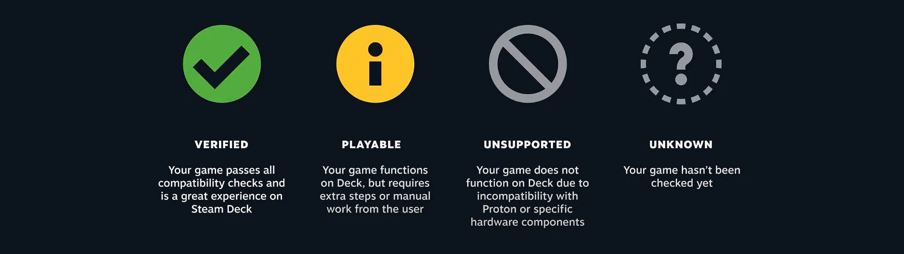

# Jogos

Essa é uma dúvida muito comum aos novos usuários de Steam Deck. Nem todos os jogos da sua biblioteca Steam vão rodar perfeitamente no Steam Deck. 

> O [Deck Verified](https://www.steamdeck.com/en/verified) é um programa que analisa os jogos no catálogo do Steam, verificando sua compatibilidade com o Steam Deck. Então, quando você visitar sua biblioteca no Steam Deck, você encontrará uma tag de compatibilidade em cada título, refletindo o tipo de experiência que você pode esperar ao jogar cada jogo no Steam Deck.

Existem 4 categorias de compatibilidade:

- **Verificado** (_Verified_) - Jogos que funcionam perfeitamente no Steam Deck.
- **Jogável** (_Playable_) - Jogos que funcionam mas que pode ser necessário algum tipo de configuraração manual para funcionar.
- **Não Suportado** (_Unsuported_) - Jogos que atualmente não funcionam no Steam Deck
- **Desconhecido** (_Unknown_) - Jogos que ainda não foram testados ou verificados no Steam Deck.

----

## Lista de Jogos Verificados no Steam Deck

- [Jogos marcados como Great on Deck na Steam Store](https://store.steampowered.com/greatondeck)
- [Lista de jogos marcados como verificado na **SUA** biblioteca da Steam](https://store.steampowered.com/steamdeck/mygames) - Necessário estar logado na sua conta da Steam.

- [Jogos marcados como Great on Deck na Steam Store (Lista Independente)](https://store.steampowered.com/curator/42167844-Great-on-Deck/) 

- [Lista de compatibilidade do ProtonDB](https://www.protondb.com/)
- [ Lista Não Oficial de Jogos verificados para rodar no Steam Deck](https://greatondeck.net/)
- [Lista de jogos compatíveis com Linux](https://www.gamingonlinux.com/)

------------
- [Página oficial de jogos do Steam Deck](https://www.steamdeck.com/pt/games)
